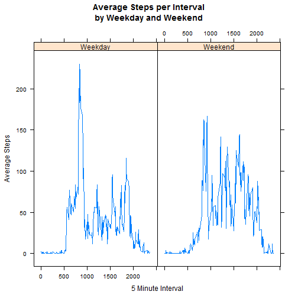

Summary of report:

The following is the description of Reproducible Research Peer Assessment 1.  My R code is included in the following chunks within the R markdown document.  The assignment details are included in their entirety and my answers are included in *italics*.  


Introduction

It is now possible to collect a large amount of data about personal movement using activity monitoring devices such as a Fitbit, Nike Fuelband, or Jawbone Up. These type of devices are part of the "quantified self" movement -- a group of enthusiasts who take measurements about themselves regularly to improve their health, to find patterns in their behavior, or because they are tech geeks. But these data remain under-utilized both because the raw data are hard to obtain and there is a lack of statistical methods and software for processing and interpreting the data.

This assignment makes use of data from a personal activity monitoring device. This device collects data at 5 minute intervals through out the day. The data consists of two months of data from an anonymous individual collected during the months of October and November, 2012 and include the number of steps taken in 5 minute intervals each day.

##Data

The data for this assignment can be downloaded from the course web site:
[click here](https://d396qusza40orc.cloudfront.net/repdata%2Fdata%2Factivity.zip)
    


```r
require(downloader)##for easier download and unzip of data file, supposedly
```

```
## Loading required package: downloader
```

```
## Warning: package 'downloader' was built under R version 3.1.3
```

```r
require(lubridate)##for date manipulation
require(dplyr)
require(lattice)
```

```
## Loading required package: lattice
```

```
## Warning: package 'lattice' was built under R version 3.1.3
```

```r
dir.create(file.path("./", "data"))
```

```
## Warning in dir.create(file.path("./", "data")): '.\\data' already exists
```

```r
options(warn=-1)##turn off warnings for download
download("http://d396qusza40orc.cloudfront.net/repdata%2Fdata%2Factivity.zip", dest="activity.zip", mode="wb") 
unzip ("activity.zip", exdir = "./data")##Get unzipped file from local working directory
```

Activity monitoring data [52K]

The variables included in this dataset are:

* steps: Number of steps taking in a 5-minute interval (missing values are coded as NA)

* date: The date on which the measurement was taken in YYYY-MM-DD format

* interval: Identifier for the 5-minute interval in which measurement was taken

The dataset is stored in a comma-separated-value (CSV) file and there are a total of 17,568 observations in this dataset.
  
##Assignment

This assignment will be described in multiple parts. You will need to write a report that answers the questions detailed below. Ultimately, you will need to complete the entire assignment in a single R markdown document that can be processed by knitr and be transformed into an HTML file.

Throughout your report make sure you always include the code that you used to generate the output you present. When writing code chunks in the R markdown document, always use echo = TRUE so that someone else will be able to read the code. This assignment will be evaluated via peer assessment so it is essential that your peer evaluators be able to review the code for your analysis.

For the plotting aspects of this assignment, feel free to use any plotting system in R (i.e., base, lattice, ggplot2)

Fork/clone the GitHub repository created for this assignment. You will submit this assignment by pushing your completed files into your forked repository on GitHub. The assignment submission will consist of the URL to your GitHub repository and the SHA-1 commit ID for your repository state.

NOTE: The GitHub repository also contains the dataset for the assignment so you do not have to download the data separately.

###Loading and preprocessing the data

Show any code that is needed to:

  1. Load the data (i.e. read.csv())
  
  2. Process/transform the data (if necessary) into a format suitable for your analysis


```r
options(warn=-1)
activity <- read.csv("./data/activity.csv", header=TRUE, sep=",")
##activity[is.na(activity)] <- 0##replace NAs with 0
summary(activity)##take a look at the raw data
```

```
##      steps                date          interval     
##  Min.   :  0.00   2012-10-01:  288   Min.   :   0.0  
##  1st Qu.:  0.00   2012-10-02:  288   1st Qu.: 588.8  
##  Median :  0.00   2012-10-03:  288   Median :1177.5  
##  Mean   : 37.38   2012-10-04:  288   Mean   :1177.5  
##  3rd Qu.: 12.00   2012-10-05:  288   3rd Qu.:1766.2  
##  Max.   :806.00   2012-10-06:  288   Max.   :2355.0  
##  NA's   :2304     (Other)   :15840
```

###What is mean total number of steps taken per day?

For this part of the assignment, you can ignore the missing values in the dataset.

  1. Make a histogram of the total number of steps taken each day
  
  2. Calculate and report the mean and median total number of steps taken per day
    

```r
activity$date <- ymd(activity$date)
activity$day <- weekdays(activity$date)
dailytotal <- activity %>% group_by(date) %>% summarise(total.steps = sum(steps, na.rm=TRUE), mean.steps = mean(steps, na.rm=TRUE), median.steps = median(steps, na.rm=TRUE) )
summary(dailytotal)
```

```
##       date             total.steps      mean.steps       median.steps
##  Min.   :2012-10-01   Min.   :    0   Min.   : 0.1424   Min.   :0    
##  1st Qu.:2012-10-16   1st Qu.: 6778   1st Qu.:30.6979   1st Qu.:0    
##  Median :2012-10-31   Median :10395   Median :37.3785   Median :0    
##  Mean   :2012-10-31   Mean   : 9354   Mean   :37.3826   Mean   :0    
##  3rd Qu.:2012-11-15   3rd Qu.:12811   3rd Qu.:46.1597   3rd Qu.:0    
##  Max.   :2012-11-30   Max.   :21194   Max.   :73.5903   Max.   :0    
##                                       NA's   :8         NA's   :8
```

```r
options(scipen=999)
hist(dailytotal$total)##Histogram of total number of steps for each date
```

 

```r
plot(dailytotal$date, dailytotal$total.steps, type = "l", xlab= "Date", ylab = "Total Steps")
```

 

```r
plot(dailytotal$date, dailytotal$median.steps, type = "l", xlab= "Date", ylab = "Median Steps")
```

 

```r
plot(dailytotal$date, dailytotal$mean.steps, type = "l", xlab= "Date", ylab = "Average Steps")
```

 
    
###What is the average daily activity pattern?

1. Make a time series plot (i.e. type = "l") of the 5-minute interval (x-axis) and the
average number of steps taken, averaged across all days (y-axis)
    
2. Which 5-minute interval, on average across all the days in the dataset, contains the
maximum number of steps?

    

```r
interval <- activity %>% group_by(interval) %>% summarise(mean.steps = mean(steps, na.rm=TRUE))
summary(interval)
```

```
##     interval        mean.steps     
##  Min.   :   0.0   Min.   :  0.000  
##  1st Qu.: 588.8   1st Qu.:  2.486  
##  Median :1177.5   Median : 34.113  
##  Mean   :1177.5   Mean   : 37.383  
##  3rd Qu.:1766.2   3rd Qu.: 52.835  
##  Max.   :2355.0   Max.   :206.170
```

```r
max_steps <- round(max(interval$mean.steps, 3))##Find max steps for display
max_interval <- which.max(interval$mean.steps)##Find position of max interval
max_interval <- interval[max_interval,]##Create max record table
plot(interval$interval, interval$mean.steps, type = "l", xlab= "5 Minute Interval", ylab = "Average Steps", main =  paste("Average Steps per 5 Minute Interval\n", "Max Interval:",                                                                                                            max_interval[,1], "Average Steps:",max_steps))
```

 


####*The maximum 5 minute interval is 835 with a value of 206 average steps.*

###Imputing missing values

Note that there are a number of days/intervals where there are missing values (coded as NA). The presence of missing days may introduce bias into some calculations or summaries of the data.

1. Calculate and report the total number of missing values in the dataset (i.e. the total number of rows with NAs)

2. Devise a strategy for filling in all of the missing values in the dataset. The strategy does not need to be sophisticated. For example, you could use the mean/median for that day, or the mean for that 5-minute interval, etc.

3. Create a new dataset that is equal to the original dataset but with the missing data filled in.

4. Make a histogram of the total number of steps taken each day and Calculate and report the mean and median total number of steps taken per day. Do these values differ from the estimates from the first part of the assignment? What is the impact of imputing missing data on the estimates of the total daily number of steps?


```r
sum(!complete.cases(activity))##Show total NAs in activity
```

```
## [1] 2304
```

```r
imputed_activity <- merge(activity, interval, by = "interval")##Append mean.steps column for each date
imputed_activity$imputed.steps <- imputed_activity$steps##Create new imputed steps column

my.na <- is.na(imputed_activity$steps)##Index NA steps

imputed_activity$imputed.steps[my.na] <- imputed_activity$mean.steps[my.na]##Replace NAs with mean.steps

hist(imputed_activity$imputed.steps)##Histogram of the imputed step values
```

 

```r
imputed_dailytotal <- imputed_activity %>% group_by(date) %>% summarise(total.steps = sum(imputed.steps, na.rm=TRUE), mean.steps = mean(imputed.steps, na.rm=TRUE), median.steps = median(imputed.steps, na.rm=TRUE) )##Calculate total, average and median steps per day with imputed steps
summary(imputed_dailytotal)
```

```
##       date             total.steps      mean.steps       median.steps   
##  Min.   :2012-10-01   Min.   :   41   Min.   : 0.1424   Min.   : 0.000  
##  1st Qu.:2012-10-16   1st Qu.: 9819   1st Qu.:34.0938   1st Qu.: 0.000  
##  Median :2012-10-31   Median :10766   Median :37.3826   Median : 0.000  
##  Mean   :2012-10-31   Mean   :10766   Mean   :37.3826   Mean   : 4.474  
##  3rd Qu.:2012-11-15   3rd Qu.:12811   3rd Qu.:44.4826   3rd Qu.: 0.000  
##  Max.   :2012-11-30   Max.   :21194   Max.   :73.5903   Max.   :34.113
```

```r
summary(dailytotal)
```

```
##       date             total.steps      mean.steps       median.steps
##  Min.   :2012-10-01   Min.   :    0   Min.   : 0.1424   Min.   :0    
##  1st Qu.:2012-10-16   1st Qu.: 6778   1st Qu.:30.6979   1st Qu.:0    
##  Median :2012-10-31   Median :10395   Median :37.3785   Median :0    
##  Mean   :2012-10-31   Mean   : 9354   Mean   :37.3826   Mean   :0    
##  3rd Qu.:2012-11-15   3rd Qu.:12811   3rd Qu.:46.1597   3rd Qu.:0    
##  Max.   :2012-11-30   Max.   :21194   Max.   :73.5903   Max.   :0    
##                                       NA's   :8         NA's   :8
```

```r
summary(imputed_activity)
```

```
##     interval          steps             date                day           
##  Min.   :   0.0   Min.   :  0.00   Min.   :2012-10-01   Length:17568      
##  1st Qu.: 588.8   1st Qu.:  0.00   1st Qu.:2012-10-16   Class :character  
##  Median :1177.5   Median :  0.00   Median :2012-10-31   Mode  :character  
##  Mean   :1177.5   Mean   : 37.38   Mean   :2012-10-31                     
##  3rd Qu.:1766.2   3rd Qu.: 12.00   3rd Qu.:2012-11-15                     
##  Max.   :2355.0   Max.   :806.00   Max.   :2012-11-30                     
##                   NA's   :2304                                            
##    mean.steps      imputed.steps   
##  Min.   :  0.000   Min.   :  0.00  
##  1st Qu.:  2.486   1st Qu.:  0.00  
##  Median : 34.113   Median :  0.00  
##  Mean   : 37.383   Mean   : 37.38  
##  3rd Qu.: 52.835   3rd Qu.: 27.00  
##  Max.   :206.170   Max.   :806.00  
## 
```

```r
summary(activity)
```

```
##      steps             date               interval          day           
##  Min.   :  0.00   Min.   :2012-10-01   Min.   :   0.0   Length:17568      
##  1st Qu.:  0.00   1st Qu.:2012-10-16   1st Qu.: 588.8   Class :character  
##  Median :  0.00   Median :2012-10-31   Median :1177.5   Mode  :character  
##  Mean   : 37.38   Mean   :2012-10-31   Mean   :1177.5                     
##  3rd Qu.: 12.00   3rd Qu.:2012-11-15   3rd Qu.:1766.2                     
##  Max.   :806.00   Max.   :2012-11-30   Max.   :2355.0                     
##  NA's   :2304
```

```r
plot(imputed_dailytotal$date, dailytotal$total.steps, type = "l", xlab= "Date", ylab = "Total Steps")
```

 

```r
plot(imputed_dailytotal$date, dailytotal$median.steps, type = "l", xlab= "Date", ylab = "Median Steps")
```

 

```r
plot(imputed_dailytotal$date, dailytotal$mean.steps, type = "l", xlab= "Date", ylab = "Average Steps")
```

 


####*There are 2,304 NA values in the steps column.*

####*Imputing the average value of steps for each interval into the NA values doesn't have an impact on the average and median values.*

###Are there differences in activity patterns between weekdays and weekends?

For this part the weekdays() function may be of some help here. Use the dataset with the filled in missing values for this part.

1. Create a new factor variable in the dataset with two levels - "weekday" and "weekend" indicating whether a given date is a weekday or weekend day.

2. Make a panel plot containing a time series plot (i.e. type = "l") of the 5-minute interval (x-axis) and the average number of steps taken, averaged across all weekday days or weekend days (y-axis). See the README file in the GitHub repository to see an example of what this plot should look like using simulated data.


```r
##Add new factor identifying weekend/weekday for each date to imputed_activity
imputed_activity$weekday <- as.factor(ifelse(weekdays(imputed_activity$date) 
                                               %in% c("Saturday","Sunday"), "Weekend", "Weekday"))##Create factor with levels Weekday and Weekend

imputed_interval <- imputed_activity %>% group_by(interval, weekday) %>% summarise(average = mean(imputed.steps))

plot <- xyplot(average ~ interval | weekday, data=imputed_interval, 
            type = 'l',
            main="Average Steps per Interval\nby Weekday and Weekend",
            xlab="5 Minute Interval",
            ylab="Average Steps")
print(plot)
```

 
